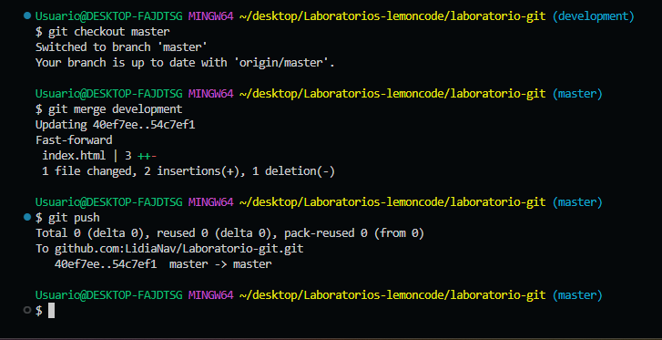

# Bootcamp JS 2 - Laboratorio Git

## Entrega

La entrega del laboratorio se realizará pegando abajo de está página el enlace correspondiente a tu repositorio de GitHub.

**IMPORTANTE: El repositorio debe contener un archivo README.md con la descripción de lo qué se ha realizado en el laboratorio, si quieres puedes añadir capturas de pantalla para explicar cómo has realizado el laborato**

## Requisitos

- Tener instalado Git en tu computadora.
- Tener una cuenta en GitHub.

## Objetivos

1. Crear un repositorio en local

- Abre tu terminal y navega hasta el directorio donde deseas crear el repositorio. -> _cd desktop/Laboratorios-lemoncode_
- Crea una carpeta con el nombre del repositorio. -> _mkdir laboratorio-git_
- Ingresa a la carpeta que acabas de crear. -> _cd laboratorio-git_
- Inicializa el repositorio de Git. -> _git init_

2. Subir el repositorio a GitHub

- Crea un nuevo repositorio en GitHub.
- Copia el URL del repositorio que acabas de crear en GitHub
- Conecta tu repositorio local con el repositorio en GitHub. -> _git remote add origin git@github.com:LidiaNav/Laboratorio-git.git_
- Verifica que la conexión se haya establecido correctamente. -> _git remote -v_

3. Hacer un commit y un push

- Crea un archivo en la carpeta del repositorio.
- Añade el archivo al staging. -> _git add . _
- Crea un commit con un mensaje descriptivo. -> _git commit -m “mensaje”_
- Sube los cambios al repositorio en GitHub. -> _git push --set-upstream origin master_

4. Crear una rama

- Crea una rama nueva llamada "development". -> _git branch development_
- Cambia a la nueva rama. -> _git checkout development_
- Realiza algunos cambios en el archivo que creaste.
- Añade y haz un commit con los cambios en la rama "development". -> _git add ._ + _git commit -am “cambios en index”_
- Sube los cambios a Github. -> _git push -u origin nombreRama_

5. Hacer un merge

- Vuelve a la rama "main". -> _git checkout master_
- Haz un merge de la rama "development" a la rama "main". -> _git merge development_
- Si no hay conflictos, los cambios realizados en la rama "development" se incorporarán a la rama "main".
- Haz un push de los cambios al repositorio en GitHub. -> _git push_

